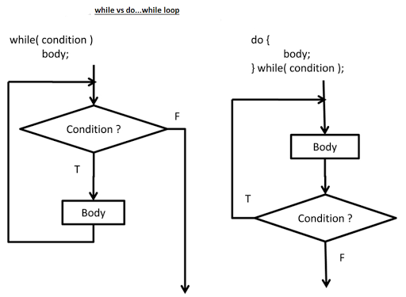

# :cartwheeling: Exercise :weight_lifting:

### do while vs while

1.1 Initialize a variable i and stop the loop once i = 20, use a while loop

1.2 Initialize a variable j and stop the loop once j = 20, use a do while loop

1.3 Which difference are you noticing, when comparing both loops?

---

### while loop practice

1. Define three variables for the LaunchCode shuttle 
- one for the starting fuel level, 
- another for the number of astronauts aboard, 
- and the third for the altitude the shuttle reaches.

2. Construct while loops to do the following:

a) Prompt the user to enter the starting fuel level. The loop should continue until the user enters a positive value greater than 5000 but less than 30000.

b) Use a second loop to query the user for the number of astronauts (up to a maximum of 7). Validate the entry by having the loop continue until the user enters an integer from 1 - 7.

c) Use a final loop to monitor the fuel status and the altitude of the shuttle. Each iteration, decrease the fuel level by 100 units for each astronaut aboard. Also, increase the altitude by 50 kilometers. (Hint: The loop should end when there is not enough fuel to boost the crew another 50 km, so the fuel level might not reach 0).

3. After the loops complete, output the result with the phrase, The shuttle gained an altitude of ___ km.

a) If the altitude is 2000 km or higher, add "Orbit achieved!"

b) Otherwise add, "Failed to reach orbit."

---

### do while loop practice

A user is currently watching TV on channel 1. :tv: The TV programm on channel 1 is boring and the user browses through the different TV channels. 

1. Use Math random to determine a number between 1 - 25. The random generated channel is the one, where the TV programm is interesting.

1.1 Now create a do while loop, where the user switches through the channels, until the channel with the interesting TV programm is found.
